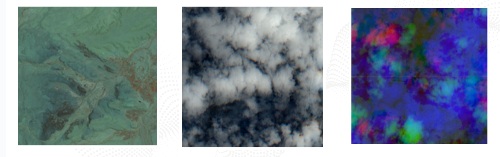

# Hackathon IndabaX South Africa 2024

Desert locusts (Schistocerca gregaria) are a species of short-horned grasshoppers known for their ability to form large, devastating swarms. They are found primarily in the deserts of Africa, the Middle East, and South Asia. They pose a significant threat to food security in Africa and are known to be the world’s most destructive pests.

One strategy towards mitigating the devastating effects of desert locusts swarms is to identify their breeding grounds in order for control activities to be carried out by the relevant agencies.

The locust breeding ground dataset in this challenge was curated by sourcing locust observations from the [United Nations (UN) Food and Agricultural Organization (FAO) Locust Hub](https://locust-hub-hqfao.hub.arcgis.com/) and enriching it with remote sensed variables such as soil moisture, temperature,
precipitation etc. from different satellite products.

## Hackathon

### Beginner track

For the beginner track you will be provided with CSV files of remote sensed variables of both a temporal and non-temporal nature of different locations. The train and validation datasets also have a `label` column which contains either a `1` indication this location is a locust breeding ground or a `0` which indicates this location is not a locust breeding ground. You will be provided with a [starter notebook](hackathon_beginner_notebook.ipynb) that implements a simple model which is trained on this data and provides a baseline prediction. Your task is to improve the model or the data preprocessing and trying to get a top spot on the [Zindi leaderboard](https://zindi.africa/competitions/indabax-south-africa-beginner/leaderboard).

|Variable          |Notes                                                          |Type         |Source         |
|------------------|---------------------------------------------------------------|-------------|---------------|
|sm_-1             |Soil moisture level on the 1st  day                            |Temporal     |[ESA CCI](https://climate.esa.int/en/projects/soil-moisture/)        |
|sm_-2             |Soil moisture level on the 2nd day                             |Temporal     |ESA CCI        |
|sm_-31            |Soil moisture level on the 31st day                            |Temporal     |ESA CCI        |
|fcover_-1         |Percentage of ground covered by vegetation on day 1.           |Temporal     |[CLMS](https://land.copernicus.eu/en/products/vegetation/fraction-of-green-vegetation-cover-v2-0-1km)           |
|fcover_-2         |Percentage of ground covered by vegetation on day 2.           |Temporal     |CLMS           |
|fcover_-31        |Percentage of ground covered by vegetation on day 31.          |Temporal     |CLMS           |
|precipitation_-1  |Amount of rainfall on day 1                                    |Temporal     |[CHIRPS](https://www.chc.ucsb.edu/data/chirps)         |
|precipitation_-2  |Amount of rainfall on day 2                                    |Temporal     |CHIRPS         |
|precipitation_-31 |Amount of rainfall on day 3                                    |Temporal     |CHIRPS         |
|land_cover        |Land Cover                                                     |Non-temporal |[Terra Climate](https://www.climatologylab.org/terraclimate-variables.html)  |
|aet               |Amount of water that evaporated or tranpirated from the surface|Non-temporal |Terra Climate  |
|def               |Climate Water Deficit                                          |Non-temporal |Terra Climate  |
|ppt               |Total amount of rainfall in a month                            |Non-temporal |Terra Climate  |
|srad              |The solar radiation reaching the earth's surface               |Non-temporal |Terra Climate  |
|swe               |Measure of the amount of water contained in snowpack.          |Non-temporal |Terra Climate  |
|tmax              |Highest temperature recorded                                   |Non-temporal |Terra Climate  |
|tmin              |Lowest temperature recorded                                    |Non-temporal |Terra Climate  |
|vap               |Measure of the amount of moisture in the air                   |Non-temporal |Terra Climate  |
|ws                |Wind speed                                                     |Non-temporal |Terra Climate  |
|vpd               |Vapor Pressure Deficit                                         |Non-temporal |Terra Climate  |
|PDSI              |Metric used to measure the severity of drought conditions      |Non-temporal |Terra Climate  |
|wadis             |Digital Elevation                                              |Non-temporal |[Open Topography](https://portal.opentopography.org/raster?opentopoID=OTALOS.112016.4326.2)|


### Advanced track

For the advanced track we use multispectral earth observation imagery from Sentinel-2 and Landsat-8 satellites. The images from both
satellites have been harmonized and made available by [NASA's Harmonized Landsat and Sentinel-2 (HLS) project.](https://hls.gsfc.nasa.gov/). For this challenge, you will get preprocessed HLS data for locust breeding ground prediction. The dataset contains temporal image data with shape 18 x 224 x 224. This data contains 6 spectral bands (Blue, Green, Red, NIR Narrow, SWIR1, SWIR2) with three temporal steps. The label is a segmentation map of shape 2 x 224 x 224, where each pixel with valid data contains a binary label. There is also a [starter notebook](hackathon_advanced_notebook.ipynb) to get you going.




## Run the code locally

First create a conda environment

```bash
conda env create -f environment.yaml
```

then activate it

```
conda activate hackathon
```

## Run the code on Google Colab

Beginner notebook:  <a target="_blank" href="https://colab.research.google.com/github/BioGeek/hackathon_indabaX_2024/blob/beginner/hackathon_beginner_notebook.ipynb">
  
</a>

Advanced notebook: <a target="_blank" href="https://colab.research.google.com/github/BioGeek/hackathon_indabaX_2024/blob/beginner/hackathon_advanced_notebook.ipynb">
  
</a>

## Credits

This dataset was provided from a collaborative research between [InstaDeep](https://www.instadeep.com/2021/12/an-early-detection-system-for-desert-locust-outbreaks-in-africa-in-collaboration-with-google-ai/), [Google AI Center in Ghana](https://blog.google/intl/en-africa/company-news/6-ways-google-is-working-with-ai-in-africa/#:~:text=3.%20Predicting%20locusts) and [UN-FAO](https://www.fao.org/locust-watch/en). Special thanks to [Ibrahim Salihu Yusuf](https://www.linkedin.com/in/ibrahim-salihu-yusuf-721103100/) for preparing the data and the starter notebooks.
